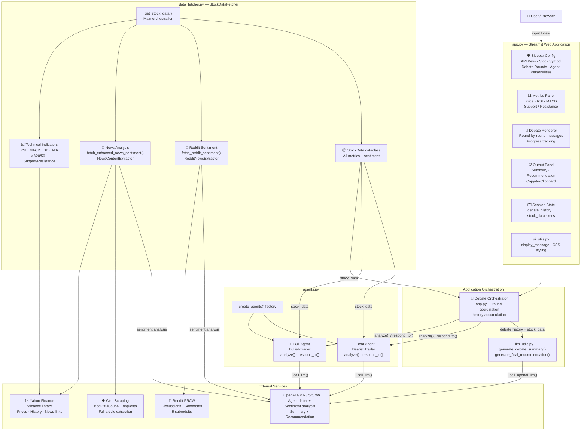
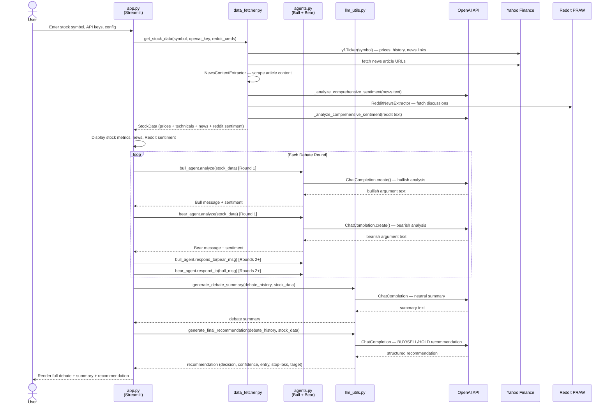
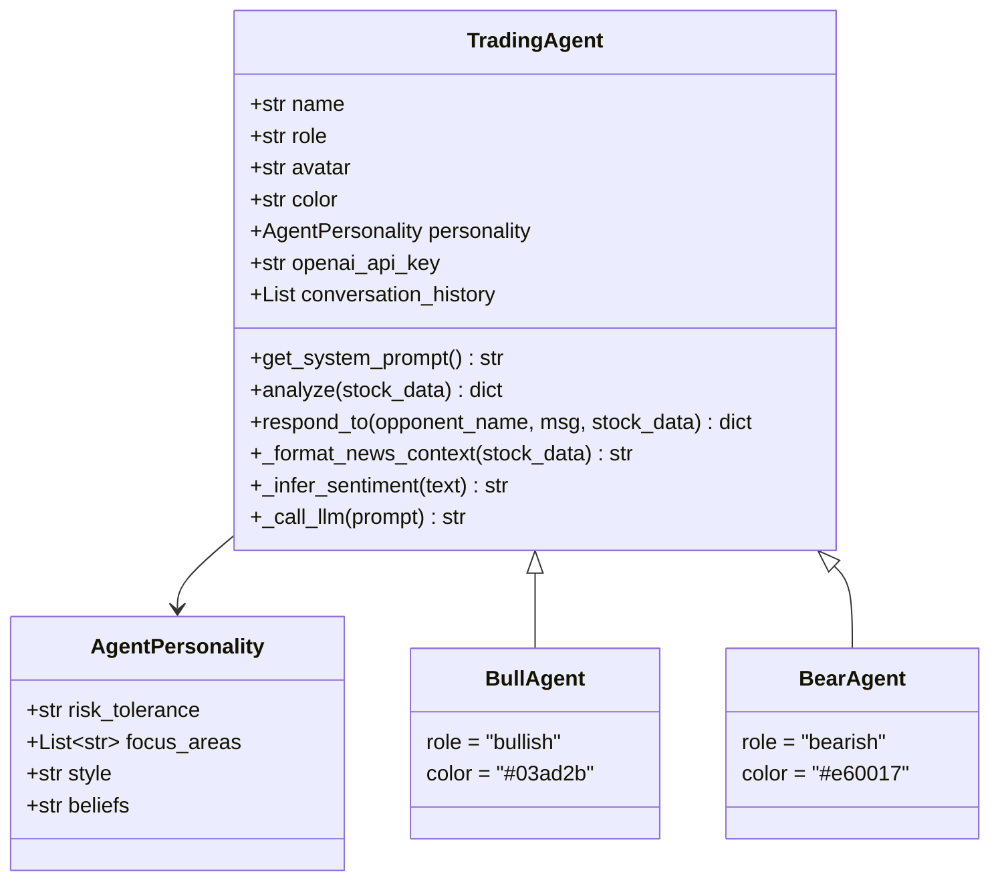
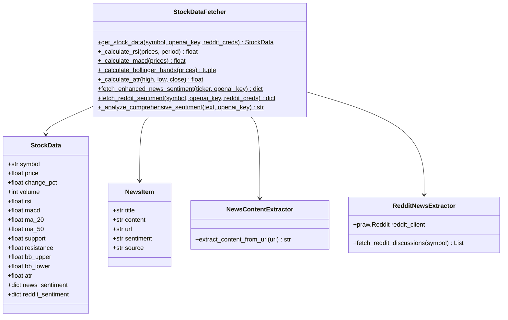
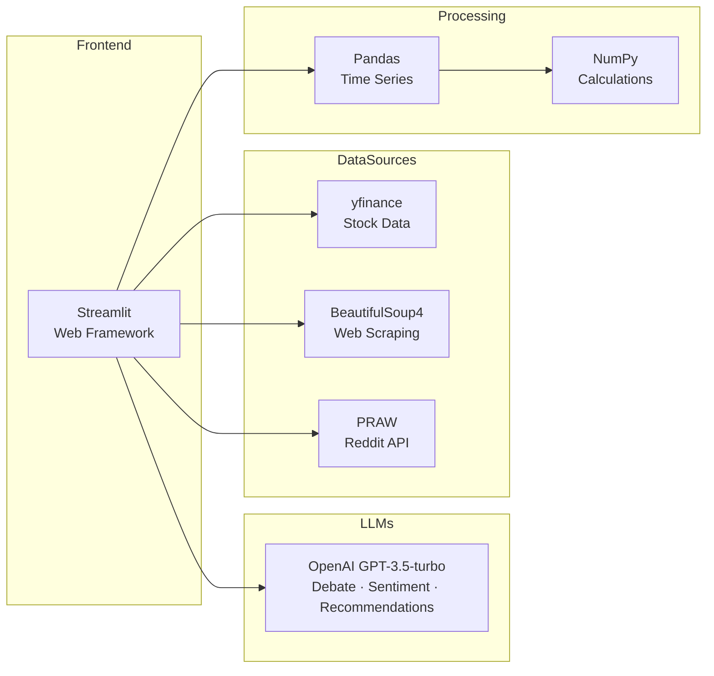
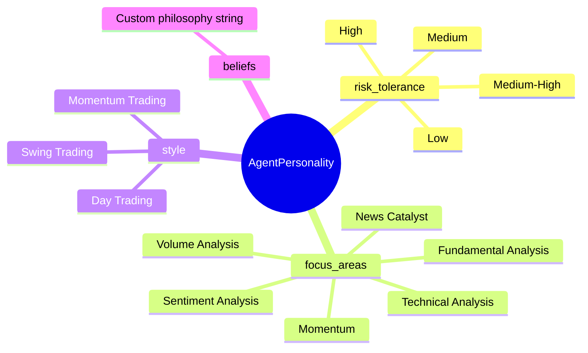
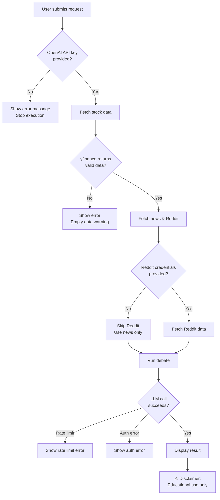

# AI Trading Debate Platform — Architecture

> **ai-trading-debate-poc** is an interactive AI-powered financial debate platform where two autonomous agents (🐂 Bull and 🐻 Bear) debate whether a stock is suitable for day trading, powered by real-time market data, technical indicators, news sentiment, and Reddit community analysis.

## Visual Diagram

The full-resolution system architecture diagram is available at:


---

## System Layers

The platform is organized into **five distinct layers**:

| Layer | Files | Responsibility |
|---|---|---|
| Presentation | `app.py`, `ui_utils.py` | Streamlit UI, user inputs, debate display |
| Application | `app.py` (orchestration), `llm_utils.py` | Debate coordination, summary, recommendations |
| Agent | `agents.py` | Bull/Bear agent logic, GPT-powered debate turns |
| Data | `data_fetcher.py` | Market data, technical indicators, sentiment |
| External Services | — | OpenAI, Yahoo Finance, Reddit, Web Scraping |

---

## Component Overview



---

## Data Flow



---

## Module Details

### `app.py` — Streamlit Application (757 lines)

The main entry point and UI orchestrator.

| Section | Lines | Responsibility |
|---|---|---|
| Sidebar Config | 256–372 | OpenAI key, Reddit credentials, stock symbol, debate rounds, agent personality customization |
| Data Fetching | 406–436 | Calls `StockDataFetcher.get_stock_data()` with credentials |
| Stock Metrics Display | 442–452 | Price, RSI, MACD, Support, Resistance panels |
| News & Reddit Sentiment | 457–513 | Sentiment breakdown, top discussions |
| Debate Execution | 520–595 | Orchestrates rounds with spinners and progress tracking |
| Summary & Recommendation | 597–628 | Generates and displays final analysis |

**Session State keys**: `debate_history`, `stock_data`, `bull_agent`, `bear_agent`, `final_recommendation`, `debate_summary`

---

### `agents.py` — AI Trading Agents (264 lines)



**Key behaviors**:
- Each agent maintains a `conversation_history` list for multi-turn context
- `_infer_sentiment()` uses keyword lists to classify text as bullish / bearish / neutral
- `_call_llm()` wraps `openai.ChatCompletion.create()` with error handling
- `_format_news_context()` injects Yahoo Finance news and Reddit discussions into the GPT prompt

---

### `data_fetcher.py` — Data Collection & Analysis (525 lines)



**Technical indicators computed**:

| Indicator | Period | Method |
|---|---|---|
| RSI | 14 | Relative Strength Index via price deltas |
| MACD | 12/26/9 EMA | Exponential Moving Average crossover |
| Bollinger Bands | 20-period, 2σ | Standard deviation bands |
| ATR | 14 | Average True Range |
| Moving Averages | 20, 50 | Simple Moving Average |
| Support / Resistance | — | Recent low / high over lookback window |

---

### `llm_utils.py` — LLM Utilities (124 lines)

| Function | Model | Temp | Max Tokens | Output |
|---|---|---|---|---|
| `generate_debate_summary()` | GPT-3.5-turbo | 0.4 | 600 | Neutral summary of both sides |
| `generate_final_recommendation()` | GPT-3.5-turbo | 0.5 | 500 | BUY/SELL/HOLD + confidence + entry/stop/target |

**Recommendation structure returned**:
```
Decision:   BUY / SELL / HOLD
Confidence: 1–10
Entry:      $XXX.XX – $XXX.XX
Stop-Loss:  $XXX.XX
Target:     $XXX.XX
Risk Level: 1–10
Reasoning:  <brief synthesis from both agents>
```

---

### `ui_utils.py` — UI Components (64 lines)

| Function | Description |
|---|---|
| `display_message(agent_info, message, sentiment)` | Renders styled agent message card with gradient, color, sentiment emoji |
| `copy_to_clipboard_button(text)` | JavaScript clipboard integration with ✅ feedback animation |

**Color scheme**:
- 🐂 Bull: `#03ad2b` (green)
- 🐻 Bear: `#e60017` (red)
- 📋 Recommendation: `#00bcd4` (cyan)

---

## Technology Stack



| Component | Library | Min Version | Auth Required |
|---|---|---|---|
| Web Framework | streamlit | ≥ 1.20.0 | — |
| LLM | openai | ≥ 1.0.0 | ✅ API Key |
| Stock Data | yfinance | ≥ 0.2.0 | — |
| Data Processing | pandas | ≥ 1.5.0 | — |
| Web Scraping | beautifulsoup4, requests | ≥ 4.11.0 | — |
| Reddit | praw | ≥ 7.0.0 | ⚠️ Optional credentials |
| Visualization | plotly | ≥ 5.0.0 | — |
| Language | Python | 3.7+ | — |

---

## Agent Personality Configuration

Users can customize both agents via the sidebar. Each `AgentPersonality` controls:



---

## Error Handling & Safety



---

## Quick Start Reference

```bash
# Install dependencies
pip install streamlit openai yfinance plotly pandas beautifulsoup4 praw requests

# Run the application
streamlit run src/app.py
```

**Required configuration (sidebar)**:
1. OpenAI API Key
2. Stock Symbol (e.g., `AAPL`, `TSLA`, `NVDA`)
3. Debate Rounds (1–5)
4. *(Optional)* Reddit Client ID + Secret

---

*This document was generated to accompany the architecture diagram at [`docs/architecture.png`](docs/architecture.png).*
