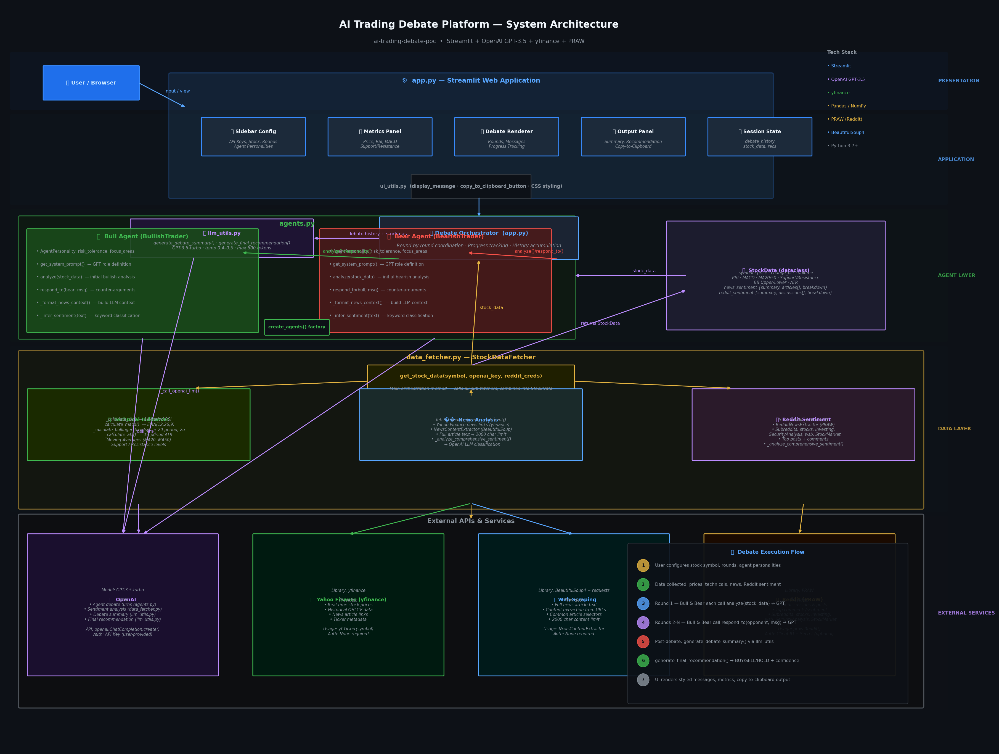
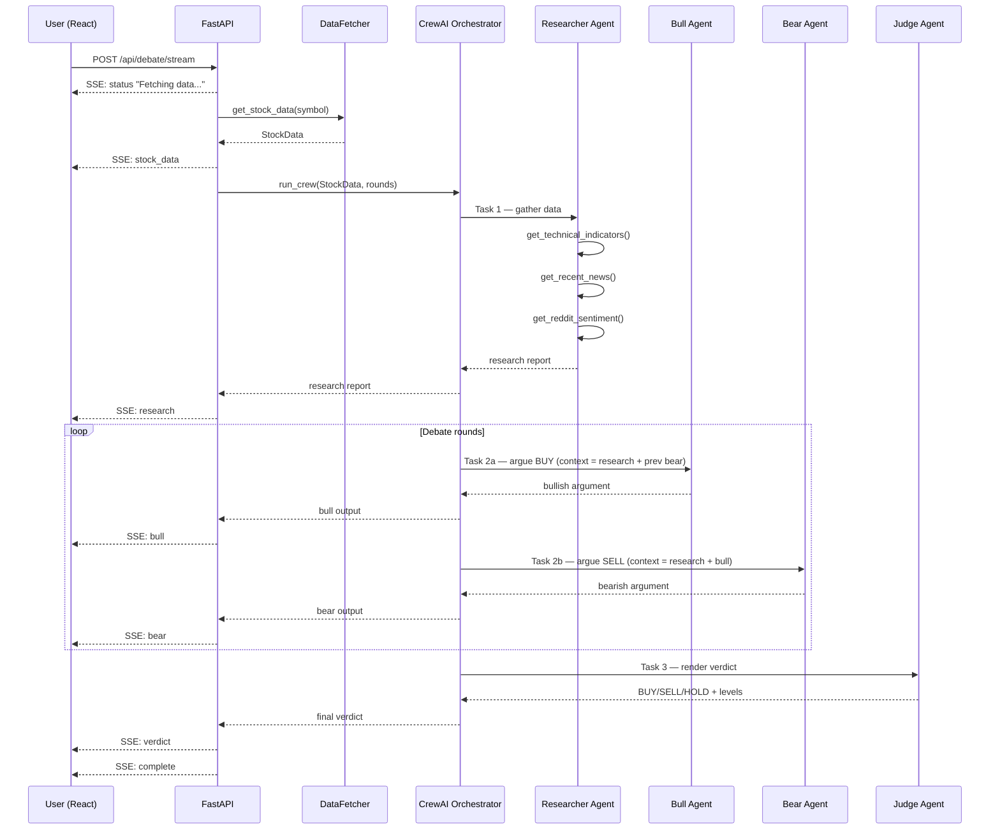
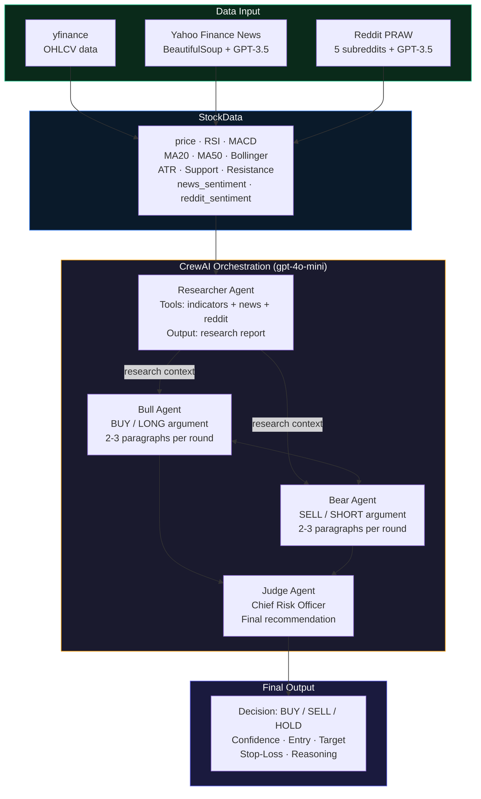

# AI Trading Debate Platform — Architecture

This document describes how the multi-agent orchestration is structured, what each agent does, and how the live debate is handled end-to-end.

## Visual Overview



---

## System Components

### (1) User & React Frontend

| Component | File | Purpose |
|-----------|------|---------|
| **ConfigPanel** | `ConfigPanel.jsx` | API keys, stock symbol, debate rounds, agent personality sliders |
| **StockMetrics** | `StockMetrics.jsx` | Colour-coded dashboard: RSI, MACD, MA20/50, Bollinger Bands, ATR |
| **DebateArena** | `DebateArena.jsx` | Live feed of researcher report and bull/bear round messages |
| **FinalVerdict** | `FinalVerdict.jsx` | Chief Risk Officer BUY / SELL / HOLD recommendation |
| **SentimentSections** | `SentimentSections.jsx` | News articles and Reddit posts with sentiment badges |

The frontend uses a **custom SSE parser** (`App.jsx`) that reads the streaming response body with `fetch()` and incrementally updates each component as events arrive.

---

### (2) FastAPI Backend & SSE Streaming

```
POST /api/debate/stream
  └─> StreamingResponse (text/event-stream)
        └─> Async Generator  (asyncio.run_in_executor)
              └─> yield  "data: {json}\n\n"
```

The backend never blocks the event loop — each synchronous LLM call is offloaded with `asyncio.run_in_executor` so the SSE connection stays alive throughout the entire debate.

**SSE Event Types**

| Event | Payload | When |
|-------|---------|------|
| `status` | `{message}` | Progress updates throughout |
| `stock_data` | Full `StockData` object | After data fetch |
| `research` | Researcher's report text | After Task 1 |
| `bull` | `{round, content}` | After each bull turn |
| `bear` | `{round, content}` | After each bear turn |
| `verdict` | CRO recommendation text | After final round |
| `complete` | `{}` | Debate finished |
| `error` | `{message}` | On any exception |

---

### (3) Data Fetcher (`data_fetcher.py`)

```
StockDataFetcher.get_stock_data(symbol)
  ├── yfinance           →  60-day OHLCV + real-time quote
  ├── Yahoo Finance RSS  →  BeautifulSoup article scraping
  │    └── OpenAI GPT-3.5-turbo  →  headline sentiment score
  └── Reddit PRAW        →  5 subreddits, top posts & comments
       └── OpenAI GPT-3.5-turbo  →  community sentiment score

Technical indicators computed locally from OHLCV:
  RSI (14)  |  MACD (12/26/9)  |  MA20 / MA50
  Bollinger Bands (20, ±2σ)  |  ATR (14)
  Support (20-period low)  |  Resistance (20-period high)

Returns: StockData dataclass
  price, change_pct, volume, RSI, MACD, MA20, MA50,
  bollinger_upper/lower, ATR, support, resistance,
  news_sentiment{}, reddit_sentiment{}
```

---

### (4) CrewAI Agent Orchestration (`crew_agentic_workflow.py`)

```
CrewAI Orchestrator  (gpt-4o-mini, temperature=0.7)
│
├── Task 1 — Researcher Agent
│     Role  : Market Data Researcher
│     Tools : get_technical_indicators()
│             get_recent_news()
│             get_reddit_sentiment()
│     Output: Comprehensive research report (passed as context to all agents)
│
├── Task 2 — Debate Loop  (Rounds 1 … max_rounds)
│     ┌─ Bull Agent  (Bullish Trading Analyst)
│     │    Task  : Formulate strongest BUY / LONG argument
│     │    Input : Research report + Bear's previous argument (from round N-1)
│     │    Output: 2-3 paragraph bullish thesis with entry price suggestion
│     │    SSE   : bull event streamed to frontend
│     │
│     └─ Bear Agent  (Bearish Trading Analyst)
│          Task  : Formulate strongest SELL / SHORT argument
│          Input : Research report + Bull's argument (current round)
│          Output: 2-3 paragraph bearish thesis with risk / exit levels
│          SSE   : bear event streamed to frontend
│
└── Task 3 — Judge Agent  (Chief Risk Officer)
      Input : Final bull & bear arguments + full research context
      Output: Final recommendation
        - Decision    : BUY / SELL / HOLD
        - Confidence  : 1-10
        - Entry price
        - Target price
        - Stop-loss level
        - Risk level  : 1-10
        - Reasoning   : concise summary
      SSE   : verdict event streamed to frontend
```

#### Agent Personalities (configurable via API)

| Parameter | Bull default | Bear default |
|-----------|-------------|-------------|
| Risk tolerance | Medium-High | Low |
| Trading style | Aggressive momentum | Conservative risk-aware |
| Focus areas | Breakouts, upside momentum | Resistance, overbought, news risks |

Personalities are passed in the `DebateRequest` body (`bull_risk_tolerance`, `bull_focus_areas`, `bull_style`, `bull_beliefs`, and matching bear fields).

---

### (5) External APIs & AI Models

| Service | Used By | Purpose |
|---------|---------|---------|
| OpenAI GPT-4o-mini | Researcher, Bull, Bear, Judge | Reasoning and argument generation |
| OpenAI GPT-3.5-turbo | Data Fetcher | News & Reddit sentiment scoring |
| yfinance | Data Fetcher | Historical OHLCV + real-time quote |
| Yahoo Finance RSS | Data Fetcher | News headlines + scraped article content |
| Reddit API (PRAW) | Data Fetcher | Community posts from r/stocks, r/investing, r/StockMarket, r/SecurityAnalysis, r/wallstreetbets |

---

## End-to-End Live Debate Flow

```
User clicks "Start Debate"
        │
        ▼
POST /api/debate/stream
        │
        ├─ status: "Fetching stock data for <SYMBOL>..."
        │
        ├─ StockDataFetcher.get_stock_data()
        │      (yfinance + Yahoo News + Reddit + GPT sentiment)
        │
        ├─ stock_data: { price, RSI, MACD, ... }
        │
        ├─ status: "Initialising CrewAI agents..."
        ├─ status: "Researcher is gathering data..."
        │
        ├─ Researcher Agent runs (tools: indicators, news, reddit)
        │
        ├─ research: "<full research report>"
        │
        ├─ FOR round = 1 to max_rounds:
        │     │
        │     ├─ status: "Agent Bull formulating case (Round N)..."
        │     ├─ Bull Agent generates bullish argument
        │     ├─ bull: { round: N, content: "..." }
        │     │
        │     ├─ status: "Agent Bear formulating counter-argument (Round N)..."
        │     ├─ Bear Agent reacts to Bull's argument
        │     └─ bear: { round: N, content: "..." }
        │
        ├─ status: "Chief Risk Officer rendering final verdict..."
        ├─ Judge Agent synthesises all arguments
        ├─ verdict: "Decision: BUY\nConfidence: 7/10\nEntry: ..."
        │
        └─ complete: {}
```

---

## Sequence Diagram



---

## Agent Orchestration Diagram



---

*For educational / demonstration use only — not financial advice.*
